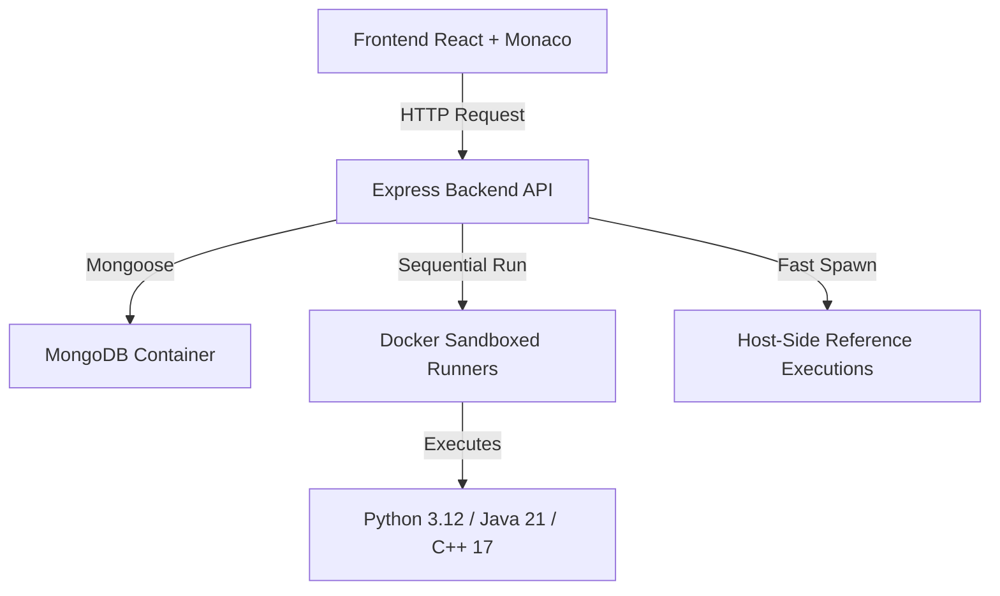

# LeetCode-Style Coding Platform Module

This repository contains an integration-ready MERN module for coding problems, Monaco editing, Docker-isolated code execution, hidden-test submission judging, and submission history.

---

## 🏗️ Architecture



### Components
* **Frontend:** React pages, Monaco editor wrapper (`CodeEditor.jsx`), and interactive test case run panel with custom stdout isolation.
* **Backend:** Express API, MongoDB schemas (Mongoose), container sandboxing service (`execution.service.js`), and a sequential judging processor.
* **Database:** MongoDB container loaded with 121 problems and 1,755 test cases.
* **Runners:** Docker containers implementing memory, CPU, PID, and networking restrictions to execute untrusted user code safely.

---

## ⚡ Key Optimizations & Custom Features

We have engineered several performance and developer experience enhancements:

### 1. ⏱️ Precision Execution Timing
Instead of measuring the overall Docker container lifecycle (which includes heavy OS startup, volume mount lag, and virtualization overhead), execution times are measured **directly inside the compiler/interpreter sandbox** around the user's function call:
* **Python:** Measured via `time.perf_counter()`.
* **Java:** Measured via `System.nanoTime()`.
* **C++:** Measured via `std::chrono::high_resolution_clock`.
* The exact time is returned via a custom stderr channel marker (`EXECUTION_TIME_MS:XXX`) and parsed by the backend, ensuring millisecond-level measurement accuracy regardless of system load.

### 2. 🐳 Minimal MongoDB Container (Footprint Optimization)
To optimize local developer system resources, we built a custom, minimal MongoDB Docker image (`mongo-runner:7.0`):
* Strips out unnecessary MongoDB client shells (`mongosh`), installer packages (`gnupg`, `wget`), database tools, and apt cache lists.
* Redux size from **1.19 GB down to 372 MB** (a ~70% reduction in uncompressed disk footprint).

### 3. 🚀 Host-Side Reference Execution
To determine expected outputs for custom user test cases, the system executes a trusted python reference solution. To avoid container startup overhead, reference solutions are run directly on the host using `child_process.spawn`. This reduces execution verification times from **~4 seconds to <10ms**.

### 4. 🖨️ Stdout / Return Value Separation
If users insert debug statements (like `print()`, `System.out.println()`, or `std::cout`) inside their code, the frontend dynamically separates standard console print logs from the actual returned value. This renders clean console prints under a **Stdout** section while keeping comparisons with expected outputs functional and clean.

### 5. ⛓️ Sequential Batch Execution
Test cases are run sequentially rather than concurrently in parallel. This prevents CPU and memory starvation on developers' local machines (such as Docker Desktop environments) and eliminates false-positive Time Limit Exceeded (TLE) errors.

---

## 📂 Folder Structure

```text
├── backend/
│   ├── docker/
│   │   ├── mongo-runner/         # Custom minimal MongoDB build
│   │   └── runners/              # Python, Java, and C++ Sandboxes
│   ├── src/
│   │   ├── config/               # Database and Env configs
│   │   ├── middleware/           # Request validators
│   │   └── modules/coding/
│   │       ├── controllers/      # Problem and execution handlers
│   │       ├── models/           # Mongoose schemas (Problem, TestCase, Submission)
│   │       ├── routes/           # REST endpoints
│   │       ├── seed/             # Seeding automation scripts
│   │       ├── services/         # Sandboxing execution & submission judging
│   │       └── utils/            # Normalizers and custom errors
├── frontend/
│   ├── src/
│   │   ├── lib/                  # Axios API configurations
│   │   └── modules/coding/
│   │       ├── components/       # Monaco Editor, TestCasePanel, Console drawers
│   │       ├── pages/            # Lists, details, and submissions
│   │       └── services/         # Frontend API integration
```

---

## 🚥 Installation & Quick Start

### 1. Clone & Setup Environments
Initialize a `.env` configuration file in the `backend` directory:
```bash
cd backend
cp .env.example .env
```
Ensure your MongoDB and Port configurations are set.

### 2. Build Minimal MongoDB & Start DB
Build and run the database container:
```bash
# Start MongoDB (using existing volume mount)
docker run -d --name coding-mongo -p 27017:27017 -v coding-mongo-data:/data/db mongo-runner:7.0
```

### 3. Build Sandbox Runners
Rebuild the isolated code compilation runners:
```bash
cd backend
npm run build:runners
```

### 4. Seed the Database
Seed the database with the core **121 problems** and **1,755 test cases**:
```bash
npm run seed:json
```

### 5. Start Backend Server
```bash
npm install
npm run dev
```

### 6. Start Frontend Development Server
In a new terminal window:
```bash
cd frontend
npm install
npm run dev
```
Open `http://localhost:5173` in your browser.

---

## 📡 Backend API Reference

### Run Code (Custom Tests)
`POST /api/coding/run/batch`
* Runs code against custom inputs using the host-side reference solver to compute expected outputs.
* **Payload:**
  ```json
  {
    "problemId": "PROBLEM_MONGO_ID",
    "language": "python",
    "code": "class Solution:\n    def twoSum(self, nums, target):\n        ...",
    "customCases": [
      { "input": "{\"nums\": [2, 7, 11, 15], \"target\": 9}" }
    ]
  }
  ```

### Submit Code (Hidden Cases)
`POST /api/coding/submit`
* Runs user code sequentially against all hidden test cases.
* **Payload:**
  ```json
  {
    "problemId": "PROBLEM_MONGO_ID",
    "language": "python",
    "code": "..."
  }
  ```
* **Response:**
  ```json
  {
    "verdict": "Accepted", // or "Wrong Answer", "Time Limit Exceeded", "Runtime Error"
    "passed": 15,
    "total": 15,
    "runtime": "50ms",
    "submissionId": "SUBMISSION_MONGO_ID"
  }
  ```

---

## 🔒 Production Hardening Checklist
- Configure rate limits per user/IP for `/run/batch` and `/submit`.
- Implement background workers/queues (such as **BullMQ** + **Redis**) to handle high submission volumes asynchronously.
- Ensure the API host alone can access the Docker socket to prevent privilege escalation.
- Add admin endpoints (`role: 'admin'`) for CRUD operations on problems and test cases.
